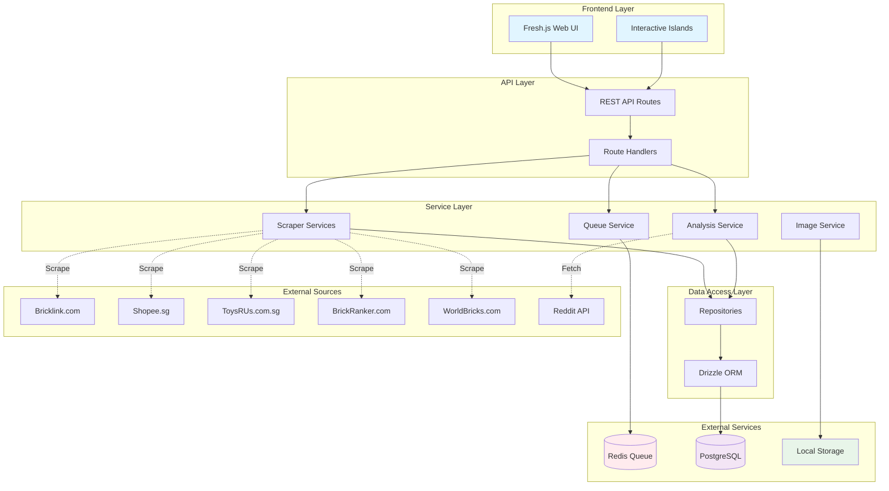
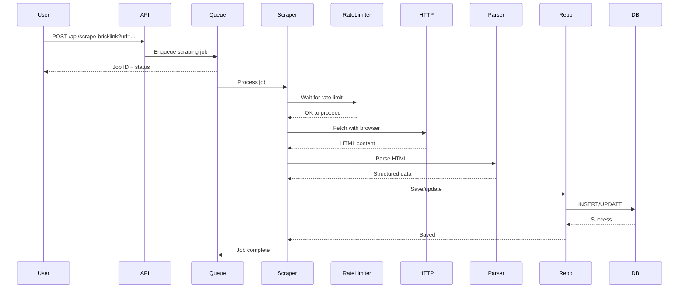
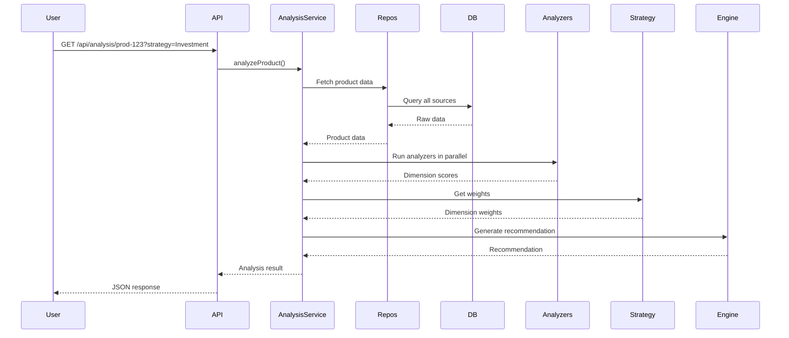
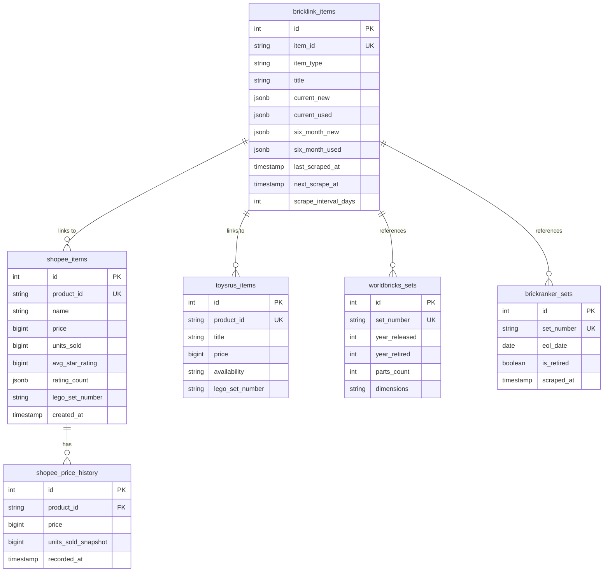
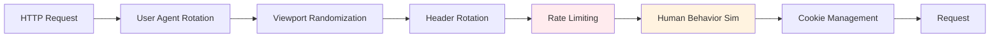

# System Architecture Overview

## Introduction

BWS (Bricklink Warehouse System) is a comprehensive LEGO price tracking and
investment analysis platform. It scrapes data from multiple sources, stores it
in PostgreSQL, and provides intelligent analysis for LEGO investment
opportunities.

## High-Level Architecture

## Core Components

### 1. Frontend Layer (Fresh.js)

**Technology**: Fresh 1.7.3 (Deno web framework) + Preact + TailwindCSS +
DaisyUI

**Routes** (`routes/`):

- `/` - Home page with product listings
- `/api/*` - RESTful API endpoints
- `/analysis-demo` - Analysis system demo

**Islands** (`islands/`): Interactive components with client-side JavaScript

- `ProductAnalysisCard` - Analysis results with strategy selector
- `PricingOverview` - Pricing comparison display

### 2. API Layer

**Location**: `routes/api/`

**Endpoints** (see [API Reference](../api/api-reference.md)):

- Scraping: `/api/scrape-bricklink`, `/api/parse-shopee`, `/api/parse-toysrus`
- Analysis: `/api/analysis/:productId`, `/api/analysis/batch`
- Queue: `/api/scrape-queue-status`, `/api/scrape-scheduler`
- CRUD: `/api/bricklink-items`

### 3. Service Layer

**Location**: `services/`

#### Scraper Services

- **BricklinkScraperService**: Scrapes Bricklink with anti-bot protection
- **ShopeeParserService**: Parses Shopee HTML for product data
- **ToysRUsScraperService**: Scrapes ToysRUs Singapore
- **BrickRankerScraperService**: Fetches retirement data
- **WorldBricksScraperService**: Extracts release years and parts count

#### Analysis Service

- **AnalysisService**: Orchestrates multi-dimensional analysis
- **RecommendationEngine**: Generates buy/hold/pass recommendations
- **Analyzers**: Pricing, Demand, Availability, Quality
- **Strategies**: Investment Focus, Quick Flip, Bargain Hunter

#### Supporting Services

- **QueueService**: BullMQ job queue for background processing
- **SchedulerService**: Automated interval-based scraping
- **RateLimiterService**: Conservative rate limiting (2-5 min delays)
- **HttpClientService**: Puppeteer-based browser automation
- **ImageDownloadService**: Download and store product images

### 4. Data Access Layer

**Location**: `db/`

**Components**:

- **Repositories**: Clean data access pattern (Repository pattern)
  - `BricklinkRepository`
  - `ShopeeRepository`
  - `ToysRUsRepository`
  - `WorldBricksRepository`
  - `BrickRankerRepository`
- **Drizzle ORM**: Type-safe database queries
- **Schema**: Database table definitions
- **Migrations**: Version-controlled schema changes

## Data Flow

### Scraping Flow

### Analysis Flow

## Database Schema

## Technology Stack

### Backend

- **Runtime**: Deno 1.37+
- **Framework**: Fresh.js 1.7.3
- **Database**: PostgreSQL 15
- **ORM**: Drizzle ORM
- **Queue**: BullMQ + Redis 7
- **Scraping**: Puppeteer (Chromium automation)

### Frontend

- **UI Framework**: Preact
- **Styling**: TailwindCSS + DaisyUI
- **Islands**: Fresh.js Islands for interactivity

### DevOps

- **Containerization**: Docker + Docker Compose
- **Database Migrations**: Drizzle Kit
- **Version Control**: Git

## Key Design Principles

### SOLID Principles

The codebase follows SOLID principles throughout (see
[.claude/CLAUDE.md](.claude/CLAUDE.md)):

- **Single Responsibility**: Each service/class has one clear purpose
- **Open/Closed**: Services open for extension, closed for modification
- **Liskov Substitution**: Services can be mocked/substituted for testing
- **Interface Segregation**: Focused interfaces, no bloated objects
- **Dependency Inversion**: Services depend on abstractions

### Other Principles

- **DRY**: Code reuse through shared utilities (`utils/`)
- **Pure Functions**: Parsers are pure functions (easy to test)
- **Immutability**: Data structures are immutable where possible
- **Repository Pattern**: Clean separation of data access
- **Service Layer**: Business logic in dedicated services

## Anti-Bot Protection

The scraping system implements multiple anti-bot measures:

**Features**:

- 30+ rotating user agents
- Random viewport sizes
- Request header randomization
- 2-5 minute delays between requests
- Mouse movement and scrolling simulation
- Automation detection removal
- Circuit breaker pattern

See [Scraper Architecture](./scraper-architecture.md) for details.

## Scaling Considerations

### Current Configuration

- Single worker processing queue
- Max 15 requests/hour per domain
- 2-5 minute delays
- Conservative and safe

### Future Scaling Options

1. **Horizontal Scaling**: Multiple worker instances
2. **Distributed Queue**: Redis Cluster for queue
3. **Database**: Read replicas, connection pooling
4. **Caching**: Redis cache layer for analysis results
5. **CDN**: Static assets and images

## Monitoring & Observability

### Current Monitoring

- Queue status endpoint: `/api/scrape-queue-status`
- Job monitoring through BullMQ
- Database query logging
- Error tracking with circuit breaker

### Future Enhancements

- [ ] Health check endpoints
- [ ] Prometheus metrics export
- [ ] Grafana dashboards
- [ ] Error alerting (Sentry)
- [ ] Performance monitoring (APM)

## Security

### Current Measures

- Environment variable configuration
- No hardcoded credentials
- SQL injection prevention (parameterized queries via Drizzle)
- Rate limiting
- Input validation

### Production Recommendations

- Use strong passwords in production
- Enable Redis authentication
- Use TLS/SSL for database connections
- Implement authentication/authorization
- Regular security updates
- Docker secret management

## Related Documentation

- [Scraper Architecture](./scraper-architecture.md) - Detailed scraper design
- [API Reference](../api/api-reference.md) - Complete API documentation
- [Database Setup](../getting-started/database-setup.md) - Database
  configuration
- [Deployment Guide](../getting-started/deployment.md) - Production deployment
- [Analysis System](../../services/analysis/README.md) - Analysis service
  details
